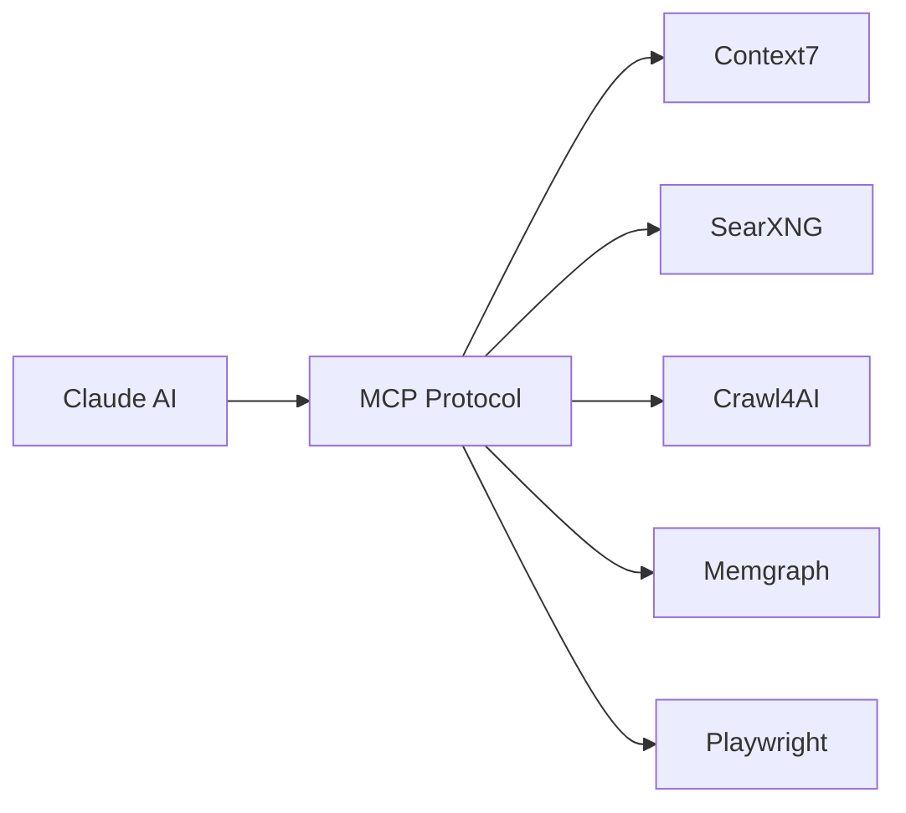

# MCP Servers

Generated projects include pre-configured Model Context Protocol (MCP) servers for enhanced AI capabilities.

## What is MCP?

The Model Context Protocol allows AI assistants like Claude to interact with external tools and services. Think of it as giving Claude superpowers.

## Available Servers

### context7

**Documentation lookup and library reference**

```
> Use context7 to find the FastAPI documentation for middleware
```

- Searches official documentation
- Returns relevant code examples
- Understands library versions

### SearXNG

**Privacy-respecting web search**

```
> Search for Python async best practices 2024
```

- No tracking
- Multiple search engines
- Returns structured results

### Crawl4AI

**Web content extraction**

```
> Fetch and summarize https://example.com/article
```

- Converts pages to markdown
- Extracts structured data
- Handles JavaScript-rendered content

### Memgraph

**Graph database operations**

```
> Query the knowledge graph for related concepts
```

- Cypher query language
- Real-time graph operations
- Built-in algorithms

### Playwright

**Browser automation**

```
> Take a screenshot of the homepage
```

- Headless browser control
- Form filling and clicking
- Screenshot capture

## Architecture



## Configuration

MCP servers are configured in `.mcp.json`:

```json
{
  "mcpServers": {
    "context7": {
      "command": "npx",
      "args": ["-y", "@context7/mcp-server"]
    },
    "searxng": {
      "url": "http://searxng:8080"
    }
  }
}
```

## Using in Dev Container

MCP servers run automatically in the Dev Container via `compose-mcp.yml`:

```yaml
services:
  searxng:
    image: searxng/searxng:latest
    ports:
      - "8080:8080"

  memgraph:
    image: memgraph/memgraph-platform
    ports:
      - "7687:7687"
```

## Without Dev Container

To use MCP servers locally, you'll need to start them manually:

```bash
# Start SearXNG
docker run -d -p 8080:8080 searxng/searxng

# Start Memgraph
docker run -d -p 7687:7687 memgraph/memgraph-platform
```

## Example Usage

### Research a Topic

```
Claude, use SearXNG to find recent articles about Python type hints,
then use Crawl4AI to summarize the top 3 results.
```

### Look Up Documentation

```
Use context7 to find how FastAPI handles request validation,
then show me an example.
```

### Automate a Browser Task

```
Use Playwright to:
1. Navigate to my app at localhost:8000
2. Create a new entity via the form
3. Take a screenshot of the result
```

## Adding New MCP Servers

1. Add to `.mcp.json`:

```json
{
  "mcpServers": {
    "my-server": {
      "command": "my-mcp-server",
      "args": ["--port", "9000"]
    }
  }
}
```

2. If containerized, add to `compose-mcp.yml`:

```yaml
services:
  my-server:
    image: my-mcp-server:latest
    ports:
      - "9000:9000"
```

## Troubleshooting

### Server Not Responding

```bash
# Check if container is running
docker ps | grep searxng

# Check logs
docker logs searxng
```

### Claude Can't Connect

Ensure you're in the Dev Container where networking is configured.

### Permission Denied

Some servers need write access. Check volume mounts in compose files.

## Next Steps

- [Claude Agents](claude-agents.md) - Using Claude with MCP
- [Docker Setup](docker-setup.md) - Container configuration
