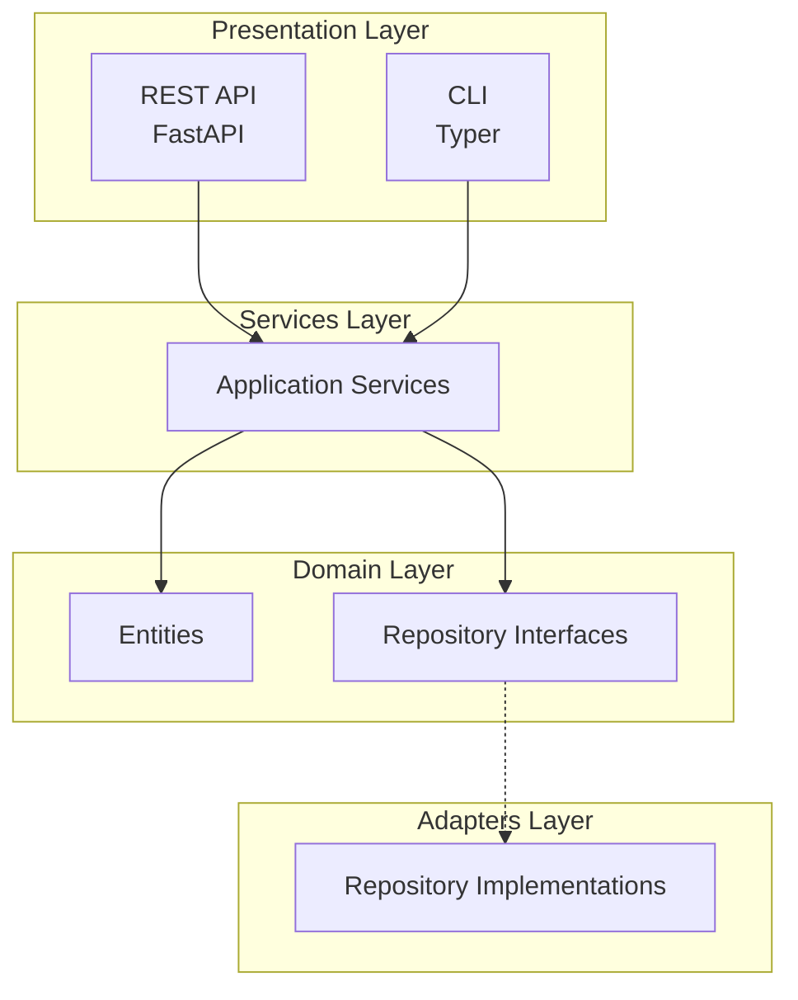

# Python Scaffold

Generated projects follow a clean 3-layer architecture inspired by Domain-Driven Design.

## Architecture Overview



## Package Structure

```
src/my_project/
├── __init__.py              # Package root, version
├── domain/                  # Core business logic
│   ├── __init__.py
│   └── entities.py          # Domain entities
├── adapters/                # Infrastructure implementations
│   ├── __init__.py
│   └── repositories/        # Data access
│       └── __init__.py
├── services/                # Application orchestration
│   └── __init__.py
├── api/                     # REST API presentation
│   ├── __init__.py
│   └── main.py              # FastAPI application
├── cli/                     # CLI presentation
│   ├── __init__.py
│   └── main.py              # Typer application
└── infrastructure/          # Cross-cutting concerns
    ├── __init__.py
    └── config.py            # Configuration
```

## The Three Layers

### Domain Layer

The **heart of your application** - pure business logic.

```python
@dataclass(frozen=True)
class ExampleEntity(EntityBase):
    """Domain entity with business rules."""
    name: str
    description: str = ""

    def is_valid(self) -> bool:
        return len(self.name) > 0
```

**Key principles:**

- Entities are immutable (`frozen=True`)
- No external dependencies
- Contains business rules
- Defines repository interfaces

### Services Layer

**Application orchestration** - coordinates domain objects.

```python
class ExampleService:
    def __init__(self, repository: ExampleRepository) -> None:
        self._repository = repository

    async def create(self, name: str, description: str = "") -> ExampleEntity:
        if not name.strip():
            raise ValueError("Name cannot be empty")
        entity = ExampleEntity(name=name.strip(), description=description)
        return await self._repository.save(entity)
```

**Key principles:**

- Depends only on domain layer
- Validates input
- Coordinates operations
- Handles transactions

### Adapters Layer

**Infrastructure implementations** - database access, external APIs.

```python
class InMemoryExampleRepository(ExampleRepository):
    def __init__(self) -> None:
        self._storage: dict[UUID, ExampleEntity] = {}

    async def save(self, entity: ExampleEntity) -> ExampleEntity:
        self._storage[entity.id] = entity
        return entity
```

**Key principles:**

- Implements domain interfaces
- Contains infrastructure details
- Easily swappable

## Presentation Layer

Two interfaces are provided out of the box:

### REST API (FastAPI)

```python
@app.post("/entities", response_model=EntityResponse)
async def create_entity(
    request: CreateEntityRequest,
    service: ExampleService = Depends(get_example_service),
) -> Any:
    entity = await service.create(request.name, request.description)
    return EntityResponse(id=entity.id, name=entity.name, ...)
```

### CLI (Typer)

```python
@app.command()
def create(
    name: str = typer.Argument(...),
    description: str = typer.Option("", "-d"),
) -> None:
    entity = run_async(service.create(name, description))
    console.print(f"Created: {entity.id}")
```

## Dependency Flow

```
Presentation → Services → Domain ← Adapters
```

The **Domain** has no dependencies. Everything points toward it, not away from it.

## Benefits

| Benefit | How It's Achieved |
|---------|-------------------|
| **Testability** | Mock adapters, test services in isolation |
| **Maintainability** | Changes are localized to specific layers |
| **Flexibility** | Swap databases without changing business logic |
| **Clarity** | Clear boundaries, obvious where code belongs |

## Extending the Scaffold

### Adding a New Entity

1. Create in `domain/entities.py`:

```python
@dataclass(frozen=True)
class Product(EntityBase):
    name: str
    price: Decimal
```

2. Add repository interface in `adapters/repositories/`
3. Create service in `services/`
4. Add API endpoints in `api/`
5. Add CLI commands in `cli/`

### Adding a Database

1. Create a new repository implementation:

```python
class PostgresExampleRepository(ExampleRepository):
    def __init__(self, session: AsyncSession):
        self._session = session
    # ... implement methods
```

2. Update dependency injection to use it

The domain and services remain unchanged!

## Next Steps

- [BEACON Framework](beacon-framework.md) - Development methodology
- [Reference](../reference/directory-structure.md) - Full file listing
