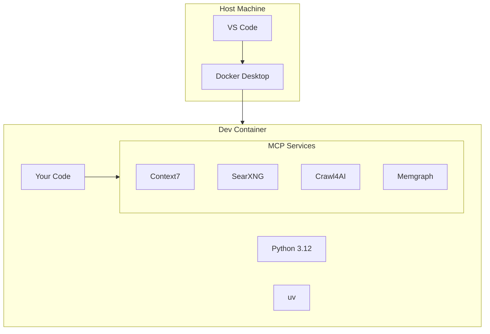

# Dev Containers

Generated projects include full VS Code Dev Container support for consistent, reproducible development environments.

## What are Dev Containers?

Dev Containers run your entire development environment inside a Docker container, ensuring:

- **Consistency** - Same environment for all developers
- **Isolation** - Dependencies don't pollute your host system
- **Reproducibility** - "Works on my machine" becomes "works everywhere"

## Prerequisites

1. [Docker Desktop](https://www.docker.com/products/docker-desktop/) installed and running
2. [VS Code](https://code.visualstudio.com/) with the [Dev Containers extension](https://marketplace.visualstudio.com/items?itemName=ms-vscode-remote.remote-containers)

## Getting Started

### 1. Open in VS Code

```bash
cd my-project
code .
```

### 2. Reopen in Container

When VS Code detects the `.devcontainer` folder, you'll see a prompt:

> Folder contains a Dev Container configuration file. Reopen folder to develop in a container.

Click **"Reopen in Container"**.

Alternatively:

1. Press `Cmd+Shift+P` (Mac) or `Ctrl+Shift+P` (Windows/Linux)
2. Type "Dev Containers: Reopen in Container"
3. Press Enter

### 3. Wait for Build

The first build takes a few minutes as it:

- Pulls the base Python image
- Installs system dependencies
- Installs Python packages
- Sets up MCP servers

Subsequent opens are much faster.

## What's Included

### Base Environment

- Python 3.12 with uv package manager
- Git and common development tools
- Pre-configured VS Code settings
- Extensions for Python development

### MCP Servers

The container includes pre-configured Model Context Protocol servers:

| Server | Purpose |
|--------|---------|
| **context7** | Documentation lookup |
| **searxng** | Web search |
| **crawl4ai** | Web scraping |
| **memgraph** | Graph database |
| **playwright** | Browser automation |

### Development Tools

- **Ruff** - Linting and formatting
- **MyPy** - Type checking
- **pytest** - Testing framework
- **MkDocs** - Documentation

## Container Architecture



## Configuration Files

### `.devcontainer/devcontainer.json`

Main configuration file:

```json
{
  "name": "my-project",
  "dockerComposeFile": ["compose.yml", "compose-mcp.yml"],
  "service": "dev",
  "workspaceFolder": "/workspace",
  "postCreateCommand": "uv sync --all-extras",
  "customizations": {
    "vscode": {
      "settings": { ... },
      "extensions": [ ... ]
    }
  }
}
```

### `.devcontainer/compose.yml`

Docker Compose for the main development container.

### `.devcontainer/compose-mcp.yml`

Docker Compose for MCP server services.

## Common Tasks

### Rebuild Container

If you change `devcontainer.json` or `Dockerfile`:

1. `Cmd+Shift+P` / `Ctrl+Shift+P`
2. "Dev Containers: Rebuild Container"

### Open Terminal

- Use the integrated terminal in VS Code
- It's already inside the container

### Access MCP Services

MCP servers are available on their configured ports:

```bash
# Inside container
curl http://searxng:8080/search?q=python
```

## Troubleshooting

### Container Won't Start

1. Ensure Docker Desktop is running
2. Try rebuilding: "Dev Containers: Rebuild Container"
3. Check Docker logs for errors

### Slow Performance

On macOS/Windows, Docker has overhead. Tips:

- Increase Docker's allocated memory
- Use `.dockerignore` to exclude large directories
- Consider using a Linux host for heavy workloads

### Extensions Not Loading

Rebuild the container to reinstall extensions:

"Dev Containers: Rebuild Container"

### Port Conflicts

If port 8000 is in use, change it in `docker-compose.yml`:

```yaml
ports:
  - "8001:8000"  # Host:Container
```

## Without Dev Containers

You can still develop without containers:

```bash
# Install dependencies locally
uv sync --all-extras

# Run locally
uv run pytest
uv run my_project serve
```

However, MCP servers won't be available without additional setup.

## Next Steps

- [MCP Servers](../features/mcp-servers.md) - Learn about AI integrations
- [Claude Agents](../features/claude-agents.md) - AI pair programming
