# Agent Implementation Guide: Adding AI Superpowers to Your Dev Environment 🤖

## Quick Start: Agent-Powered Development in 30 Minutes

### Step 1: Add Agent Directory Structure
```bash
{{cookiecutter.project_slug}}/
├── .claude/
│   ├── agents/           # Your AI army lives here
│   │   ├── deploy.yml    # Deployment specialist
│   │   ├── feature.yml   # Feature factory
│   │   ├── debug.yml     # Error detective
│   │   ├── optimize.yml  # Performance guardian
│   │   └── document.yml  # Documentation scribe
│   └── agent_prompts/    # Reusable prompt templates
```

### Step 2: Core Agent Configurations

#### The Deployment Agent
```yaml
# .claude/agents/deploy.yml
name: "Deploy Master"
description: "Handles all deployment tasks autonomously"
tools:
  - Bash
  - Read
  - Write
  - Edit
triggers:
  - "git push to main"
  - "make deploy"
  - "commit message contains 'ship'"
prompt: |
  You are a deployment specialist. Your job is to:
  1. Build and test the application
  2. Deploy to {{cookiecutter.deploy_to}}
  3. Run post-deployment checks
  4. Notify about the deployment status
  
  Always ensure zero-downtime deployments.
  If something fails, rollback and notify.
  
  Project: {{cookiecutter.project_name}}
  Deploy target: {{cookiecutter.deploy_to}}
```

#### The Feature Factory Agent
```yaml
# .claude/agents/feature.yml
name: "Feature Builder"
description: "Creates complete features from descriptions"
tools:
  - Read
  - Write
  - MultiEdit
  - Bash
  - Task  # Can spawn sub-agents!
capabilities:
  auth:
    template: ".claude/templates/auth_complete.py"
    includes: ["models", "endpoints", "middleware", "tests"]
  payments:
    template: ".claude/templates/stripe_integration.py"
    includes: ["checkout", "webhooks", "subscriptions"]
  email:
    template: ".claude/templates/email_system.py"
    includes: ["templates", "queue", "providers"]
prompt: |
  You build complete, production-ready features.
  When asked to add a feature:
  1. Use existing templates if available
  2. Create all necessary files
  3. Add migrations if needed
  4. Include basic tests
  5. Update documentation
  
  Make it work first, optimize later.
```

#### The Debug Detective Agent
```yaml
# .claude/agents/debug.yml
name: "Error Eliminator"
description: "Finds and fixes errors autonomously"
tools:
  - Read
  - Grep
  - Edit
  - Bash
  - Sequential  # For complex debugging
auto_trigger:
  - error_in_console
  - failed_deployment
  - test_failure
prompt: |
  You are an expert debugger. When you detect an error:
  1. Capture full context and stack trace
  2. Identify root cause (not just symptoms)
  3. Implement a proper fix (not a bandaid)
  4. Test the fix works
  5. Commit with clear explanation
  
  Common patterns to check:
  - Missing imports/dependencies
  - Type errors
  - Async/await issues
  - Environment variable problems
  - Database connection issues
```

### Step 3: Enhanced Makefile with Agent Commands

```makefile
# Makefile
.PHONY: agent-help
agent-help:
	@echo "🤖 Agent Commands:"
	@echo "  make agents          - List all available agents"
	@echo "  make add-feature F=  - Add a complete feature"
	@echo "  make fix-all         - Fix all errors and warnings"
	@echo "  make optimize        - Optimize performance"
	@echo "  make ship            - Deploy with zero downtime"

# Parallel feature building
add-feature:
	@echo "🏭 Feature Factory starting..."
	@claude-code agent run feature "Add $(F) feature with all components"

# Multi-agent operations
power-hour:
	@echo "⚡ Power Hour: Building multiple features in parallel..."
	@claude-code agent run-parallel \
		"feature: Add complete authentication system" \
		"feature: Add Stripe payment integration" \
		"feature: Add email notification system" \
		"optimize: Optimize database queries" \
		"document: Update all documentation"
	@echo "☕ Go grab coffee. Your app is building itself!"

# Autonomous deployment
ship:
	@claude-code agent run deploy "Deploy to production with zero downtime"

# Fix everything
fix-all:
	@echo "🔧 Dispatching fix agents..."
	@claude-code agent run-parallel \
		"debug: Fix all linting errors" \
		"debug: Fix all type errors" \
		"debug: Fix failing tests" \
		"optimize: Fix performance issues"

# Background optimization
night-shift:
	@echo "🌙 Starting night shift agents..."
	@claude-code agent run-background \
		"optimize: Profile and optimize slow queries" \
		"security: Scan and patch vulnerabilities" \
		"cleanup: Remove dead code and unused dependencies" \
		"test: Add missing test coverage"
	@echo "😴 Sweet dreams! Check the improvements in the morning."
```

### Step 4: Agent Templates for Common Features

#### Authentication Template
```python
# .claude/templates/auth_complete.py
"""
Complete authentication system template.
Includes: Registration, Login, JWT, Password Reset, OAuth
"""

# Models
class User(BaseModel):
    email: str
    hashed_password: str
    is_active: bool = True
    created_at: datetime
    
# Endpoints
@app.post("/auth/register")
async def register(email: str, password: str):
    # Implementation provided by agent
    pass

@app.post("/auth/login") 
async def login(email: str, password: str):
    # Returns JWT token
    pass

# ... complete implementation generated by agent
```

### Step 5: Integration with Existing MCP Servers

```yaml
# .claude/agents/research.yml
name: "Research Agent"
description: "Researches best practices and implementations"
tools:
  - WebSearch
  - Context7  # For documentation
  - mcp__crawl4ai  # Fallback for web content
  - Sequential  # For analysis
prompt: |
  Research best practices for the requested feature.
  Use Context7 for official documentation.
  Use WebSearch for recent tutorials and examples.
  Use crawl4ai if fetch fails.
  
  Provide implementation recommendations based on:
  1. Official documentation
  2. Community best practices
  3. Security considerations
  4. Performance implications
```

### Step 6: Agent Coordination System

```python
# .claude/agent_coordinator.py
"""
Coordinates multiple agents for complex tasks
"""

class AgentCoordinator:
    def __init__(self):
        self.max_parallel = 10
        self.running_agents = []
    
    def run_startup_sequence(self):
        """What happens when you start coding"""
        agents = [
            ("environment", "Validate development environment"),
            ("git", "Check git status and pull latest"),
            ("dependencies", "Update dependencies if needed"),
            ("database", "Ensure database is migrated"),
            ("previous", "Show what you worked on yesterday")
        ]
        return self.run_parallel(agents)
    
    def run_feature_brigade(self, features):
        """Build multiple features in parallel"""
        agents = []
        for feature in features:
            agents.append((
                f"feature_{feature}",
                f"Build complete {feature} feature"
            ))
        return self.run_parallel(agents, wait=True)
```

### Step 7: Cookiecutter Integration

Add to `cookiecutter.json`:
```json
{
  "enable_agents": "yes",
  "agent_capabilities": {
    "auto_deploy": ["yes", "no"],
    "auto_fix_errors": ["yes", "no"],
    "background_optimization": ["yes", "no"],
    "parallel_features": ["yes", "no"]
  },
  "default_agents": ["deploy", "feature", "debug", "optimize", "document"],
  "agent_trigger_mode": ["automatic", "manual", "hybrid"]
}
```

### Step 8: The Magic `make` Commands

```makefile
# The "I have an idea" command
idea:
	@read -p "What's your app idea? " idea; \
	claude-code agent run-parallel \
		"research: Research $$idea and find best practices" \
		"architect: Design database schema for $$idea" \
		"feature: Create MVP implementation of $$idea" \
		"deploy: Prepare deployment configuration"
	@echo "💡 Your idea is becoming reality..."

# The "Make it better" command  
better:
	@claude-code agent analyze-and-improve \
		--performance "Optimize all slow operations" \
		--security "Fix security vulnerabilities" \
		--ui "Polish user interface" \
		--code "Refactor messy code"

# The "I'm stuck" command
unstuck:
	@claude-code agent help-me \
		--context "last-error" \
		--debug "deep" \
		--suggest "solutions" \
		--implement "best-option"
```

## Practical Examples

### Example 1: Building a SaaS in 30 Minutes
```bash
$ make idea
What's your app idea? Task management SaaS with team collaboration

🤖 Spawning agents...
├── Research Agent: Finding best practices for task management apps
├── Architect Agent: Designing scalable database schema
├── Feature Agent: Building core task CRUD operations
├── Feature Agent 2: Adding team collaboration features
├── UI Agent: Creating responsive interface
└── Deploy Agent: Setting up Railway configuration

⏰ 28 minutes later...
✅ Your app is live at: https://tasks-team.railway.app
```

### Example 2: The Monday Morning Cleanup
```bash
$ make monday
🌅 Good morning! Running your Monday cleanup...

├── Git Agent: Pulled latest changes
├── Dependency Agent: Updated 3 packages
├── Test Agent: Fixed 2 failing tests
├── Lint Agent: Cleaned up 15 style issues
├── Performance Agent: Optimized 3 slow queries
└── Doc Agent: Updated README with Friday's changes

☕ Your codebase is fresh and clean!
```

### Example 3: Emergency Bug Fix
```bash
# Error detected in production
🚨 Error Agent: Detected 500 error in /api/users
🔍 Debug Agent: Analyzing error pattern...
💡 Debug Agent: Found issue - missing null check
🔧 Fix Agent: Implementing fix...
✅ Test Agent: Fix verified, all tests passing
🚀 Deploy Agent: Deploying hotfix...
📱 Notify Agent: Sent fix notification to Discord

Total time: 3 minutes (you were getting coffee)
```

## The New Development Flow

```mermaid
graph TD
    A[💡 Idea] --> B{Choose Path}
    B -->|Fast| C[make idea]
    B -->|Custom| D[make add-feature]
    B -->|Multiple| E[make power-hour]
    
    C --> F[Agents Build Everything]
    D --> F
    E --> F
    
    F --> G[☕ You Get Coffee]
    G --> H[✅ App is Live]
    
    H --> I{What Next?}
    I -->|Optimize| J[make better]
    I -->|Fix Issues| K[make fix-all]
    I -->|Add More| L[make add-feature]
    I -->|Ship Update| M[make ship]
```



## Pro Tips

1. **Agent Specialization**: Create agents for your specific needs
   ```yaml
   # .claude/agents/my-special.yml
   name: "API Versioning Agent"
   description: "Handles API versioning for my startup"
   ```

2. **Agent Learning**: Agents can reference previous work
   ```yaml
   prompt: |
     Learn from previous implementations in this codebase.
     Follow established patterns unless improving them.
   ```

3. **Agent Composition**: Agents can spawn sub-agents
   ```yaml
   prompt: |
     For complex features, spawn specialized sub-agents:
     - One for database design
     - One for API implementation  
     - One for UI components
   ```

## Next Steps

1. **This Weekend**: Add basic agents (deploy, feature, debug)
2. **Next Week**: Add specialized agents for your workflow
3. **Next Month**: Build your own agent marketplace

Remember: The goal isn't to automate everything. It's to automate the boring parts so you can focus on the fun, creative work that only humans can do.

Your agents are waiting. Time to build something amazing! 🚀