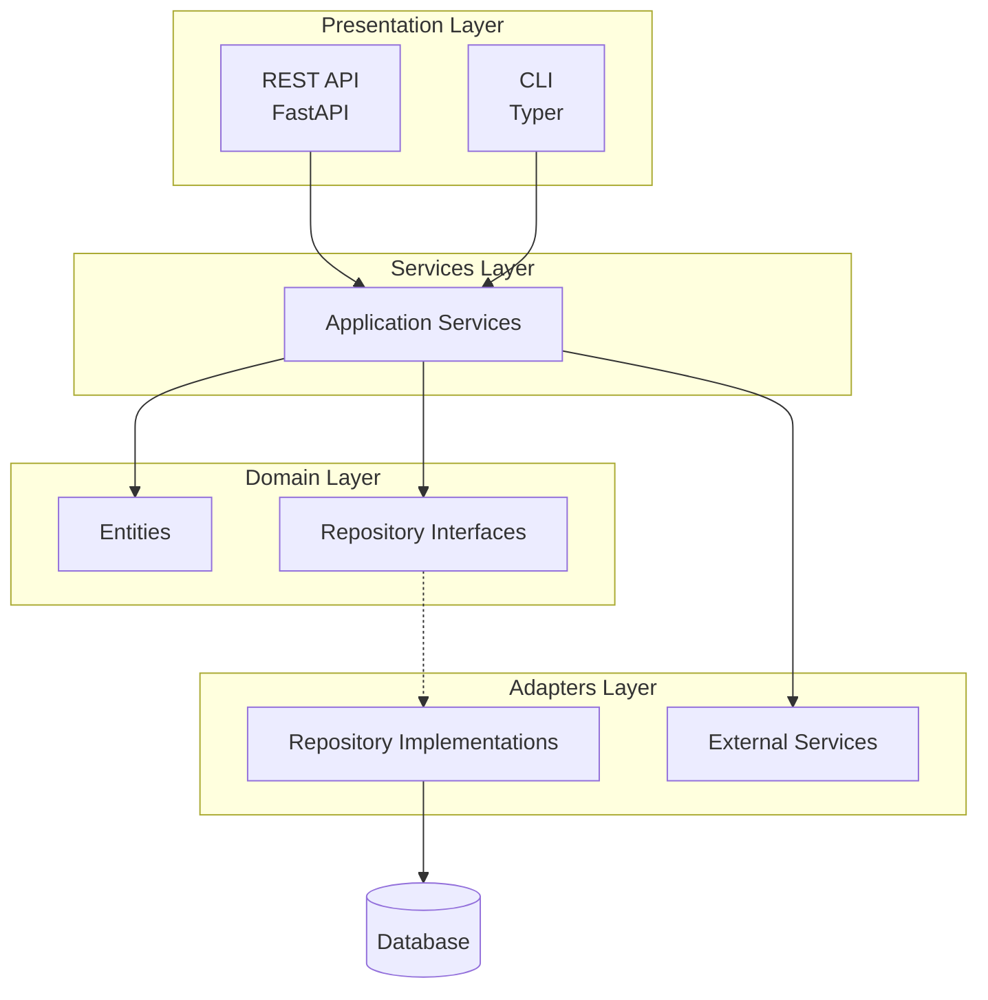

# Architecture Overview

{{ cookiecutter.project_name }} follows a clean 3-layer architecture inspired by Domain-Driven Design and Palantir's Ontology patterns.

## The Three Layers



## Layer Responsibilities

### Domain Layer (Semantic)

The **core business logic** - entities, value objects, and domain rules.

- **Location**: `src/{{ cookiecutter.project_slug|replace('-', '_') }}/domain/`
- **Dependencies**: None (pure Python)
- **Contains**: Entities, value objects, domain events, repository interfaces

```python
@dataclass(frozen=True)
class ExampleEntity(EntityBase):
    name: str
    description: str = ""

    def is_valid(self) -> bool:
        return len(self.name) > 0
```

!!! tip "Key Principle"
    Domain entities should be **immutable** and contain only business logic, never infrastructure concerns.

### Services Layer (Dynamic)

The **application orchestration** - use cases and business operations.

- **Location**: `src/{{ cookiecutter.project_slug|replace('-', '_') }}/services/`
- **Dependencies**: Domain layer only
- **Contains**: Application services, use case implementations

```python
class ExampleService:
    def __init__(self, repository: ExampleRepository) -> None:
        self._repository = repository

    async def create(self, name: str, description: str = "") -> ExampleEntity:
        entity = ExampleEntity(name=name, description=description)
        return await self._repository.save(entity)
```

!!! tip "Key Principle"
    Services coordinate work but **delegate** to domain entities and repositories.

### Adapters Layer (Kinetic)

The **infrastructure implementations** - database access, external APIs, etc.

- **Location**: `src/{{ cookiecutter.project_slug|replace('-', '_') }}/adapters/`
- **Dependencies**: Domain interfaces
- **Contains**: Repository implementations, API clients, adapters

```python
class InMemoryExampleRepository(ExampleRepository):
    def __init__(self) -> None:
        self._storage: dict[UUID, ExampleEntity] = {}

    async def save(self, entity: ExampleEntity) -> ExampleEntity:
        self._storage[entity.id] = entity
        return entity
```

!!! tip "Key Principle"
    Adapters **implement** domain interfaces, keeping infrastructure swappable.

## Dependency Flow

```
Presentation → Services → Domain ← Adapters
```

- **Presentation** depends on Services
- **Services** depend on Domain (entities + interfaces)
- **Adapters** implement Domain interfaces
- **Domain** has no external dependencies

This is the **Dependency Inversion Principle** in action.

## Benefits

| Benefit | Description |
|---------|-------------|
| **Testability** | Each layer can be tested in isolation |
| **Maintainability** | Changes are localized to specific layers |
| **Flexibility** | Swap implementations without changing business logic |
| **Clarity** | Clear boundaries make code easier to understand |

## Package Structure

```
src/{{ cookiecutter.project_slug|replace('-', '_') }}/
├── domain/              # Core business logic
│   ├── __init__.py
│   └── entities.py      # Domain entities
├── adapters/            # Infrastructure implementations
│   ├── __init__.py
│   └── repositories/    # Repository implementations
├── services/            # Application orchestration
│   └── __init__.py      # Service classes
├── api/                 # REST API presentation
│   ├── __init__.py
│   └── main.py          # FastAPI application
├── cli/                 # CLI presentation
│   ├── __init__.py
│   └── main.py          # Typer application
└── infrastructure/      # Cross-cutting concerns
    ├── __init__.py
    └── config.py        # Configuration management
```

## Next Steps

- [Domain Layer](domain.md) - Deep dive into entities
- [Adapters Layer](adapters.md) - Repository patterns
- [Services Layer](services.md) - Use case implementation
